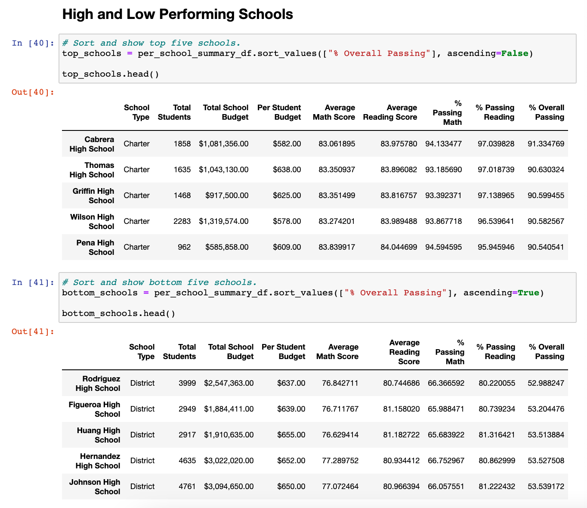
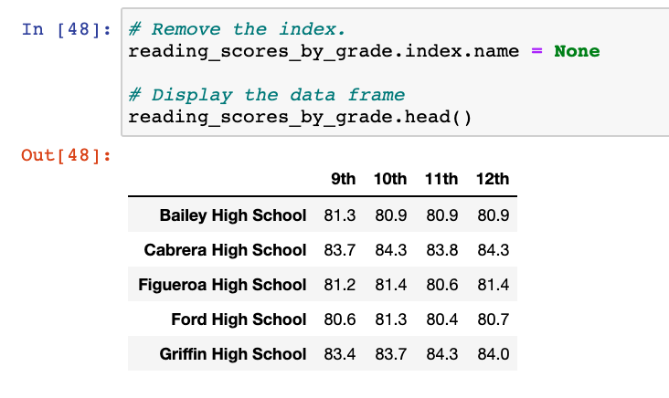
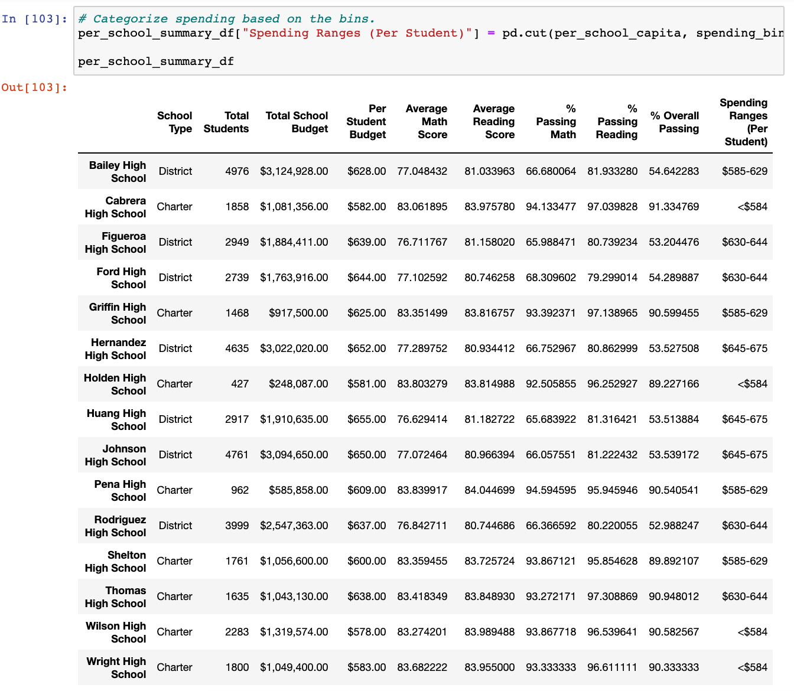
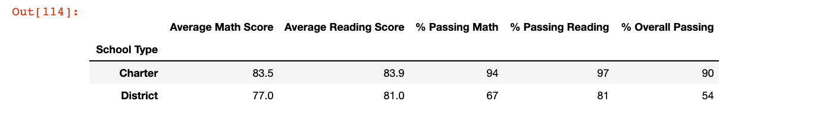

# School_District_Analysis

## Challenge Overview
The school board in which this prject was created for has concerns that the nineth-grade class at Thomas High School is suspected of academic dishonesty. They would like to uphold state-testing standards and have asked for assistance.

1. Replace ninth-grade reading and math scores
2. Repeat the school district analysis
    - The district summary
    - The school summary
    - The top 5 and bottom 5 performing schools, based on the overall passing rate
    - The average math score for each grade level from each school
    - The average reading score for each grade level from each school
    - The scores by school spending per student, by school size, and by school type

## School District Analysis Results

#### Deliverable 1: Thomas High School Reading & Math Score Summary (with nineth-grade adjustments)    

- The nineth-grade class at Thomas High School will have their reading and math scores replaced with NaNs due to the school board's suspicion that these scores may have been tampered with.

#### Deliverable 2: The District Summary

- According to the District Summary, we can see that there were a total of 15 schools amassing 39,170 students with a budget of $24,649,428.00. The overall passing rate of all students is 64.9% (74.8% passing math and 85.7% passing reading).

#### Deliverable 2: The School Summary

- We are now able to see if the school is a charter school or a district school as well as each school's individual breakdowns (i.e. avereage reading and math scores and budget).

#### Deliverable 2: Top 5 and bottom 5 performing schools, based on the overall passing rate

- After viewing the top 5 and bottom 5 we conclude that all of the top 5 performing schools are charter schools. We can also conclude that the budget amount per student does not play a part in the success of highest performing schools.

#### Deliverable 2: Average math score for each grade level from each school

- The average math score for each grade level from each grade shows that all schools had an above average grade.

#### Deliverable 2: Average reading score for each grade level from each school

- The average reading score for each grade level from each grade shows that all schools had an average of 80% or higher.

#### Deliverable 2: The scores by spending per student

#### Deliverable 2: Scores by size and school type 

- Overall, Charter schools did better than district schools by nearly 50%.

## Challenge Summary
From this analysis, it is obvious that charter schools have a higher passing rate than district schools. One may think that charter schools have a greater budget than district schools, but that is not the case here. What was apparent was that charter schools had less students enrolled compared to that of district schools. One could argue that smaller class sizes in cherter schools would allow for students more 1 on 1 access from their teachers, explaining why charter test scores and average passing rate was a lot higher than in district schools.
