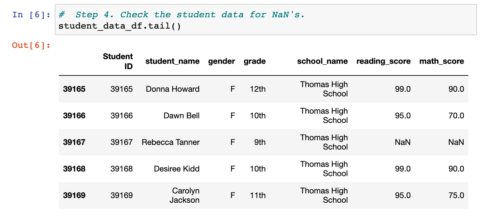
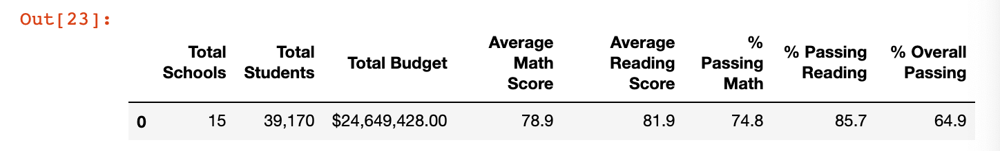
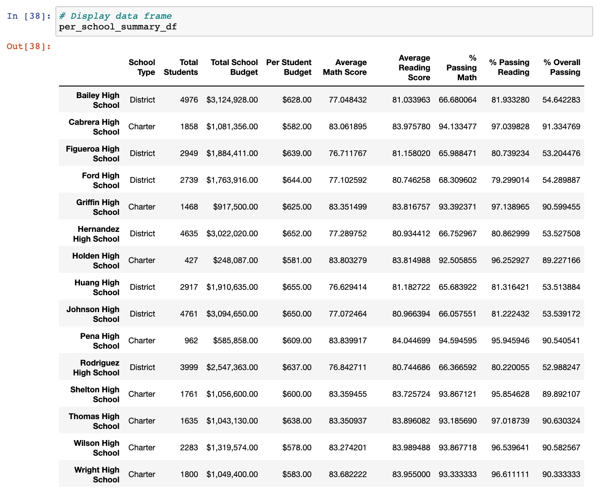

# School_District_Analysis

## Challenge Overview
The school board in which this prject was created for has concerns that the nineth-grade class at Thomas High School is suspected of academic dishonesty. They would like to uphold state-testing standards and have asked for assistance.

1. Replace ninth-grade reading and math scores
2. Repeat the school district analysis
    - The district summary
    - The school summary
    - The top 5 and bottom 5 performing schools, based on the overall passing rate
    - The average math score for each grade level from each school
    - The average reading score for each grade level from each school
    - The scores by school spending per student, by school size, and by school type

## School District Analysis Results

#### Deliverable 1: Thomas High School Reading & Math Score Summary (with nineth-grade adjustments)    

- The nineth-grade class at Thomas High School will have their reading and math scores replaced with NaNs due to the school board's suspicion that these scores may have been tampered with.

#### Deliverable 2: The District Summary

- According to the District Summary, we can see that there were a total of 15 schools amassing 39,170 students with a budget of $24,649,428.00. The overall passing rate of all students is 64.9% (74.8% passing math and 85.7% passing reading).

#### Deliverable 2: The School Summary

- We are now able to see if the school is a charter school or a district school as well as each school's individual breakdowns (i.e. avereage reading and math scores and budget).

## Challenge Summary
With the information provided, the Colorado Board of Elections Commission may be inclined to use this same script for future elections to obtain beneficial data. One way it can be modified is to structure it so that it can be determined in which county a candidate may have been more popular based on votes. Another way this script can be altered is to expand to other counties and get an even more detailed read of information for the entire state of Colorado.
